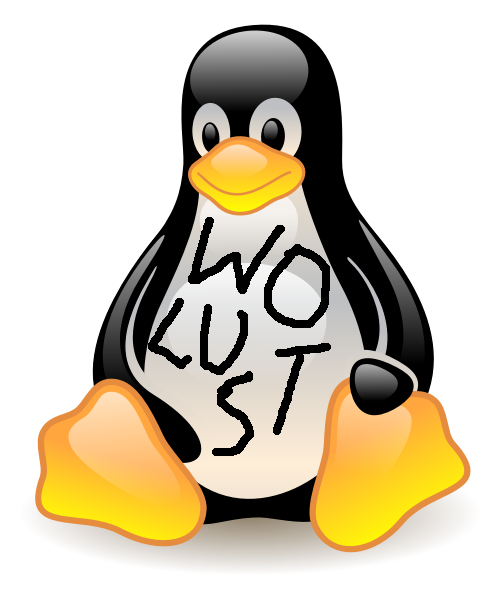

**WOLUST** steht für *Wormser Linux User Stammtisch*. Wir treffen uns jeden ersten Dienstag im Monat zum lockeren Austausch über Linux, Open Source und andere nerdige Themen.

Wenn Dich Linux interessiert, komm vorbei und setz dich dazu!

Weitere Informationen findest du in den folgenden Dokumenten und in unserem Blog.
